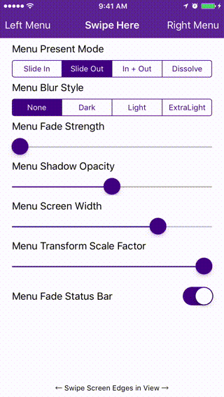
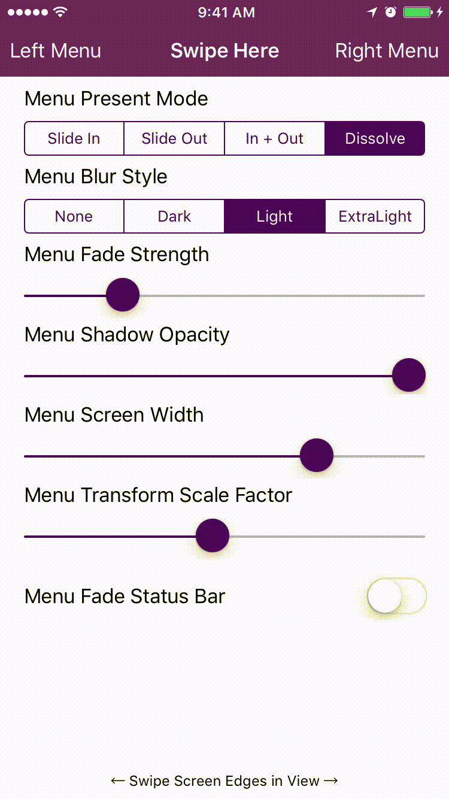
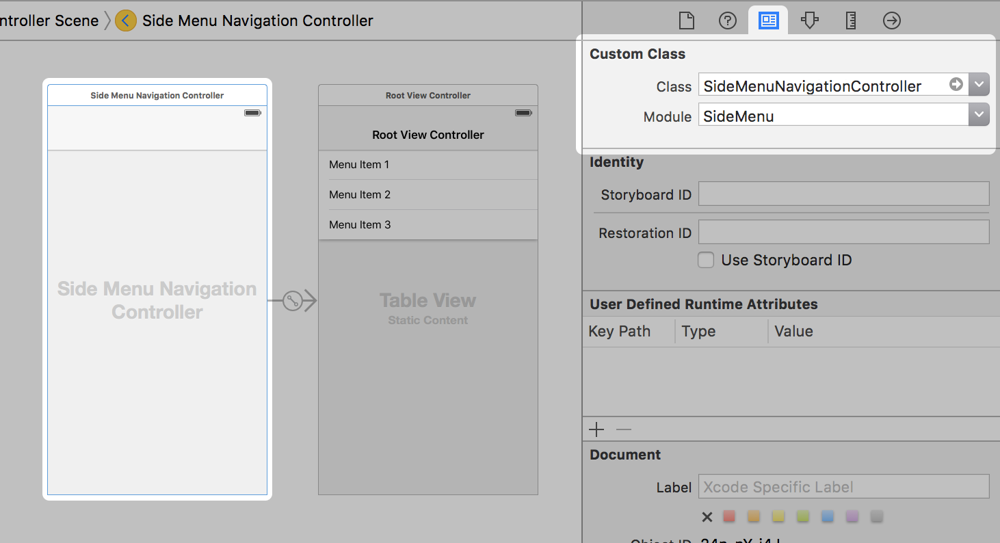
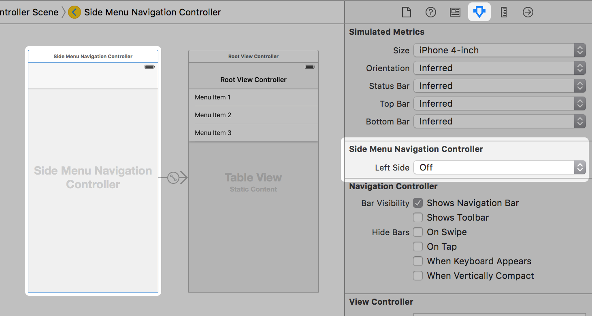
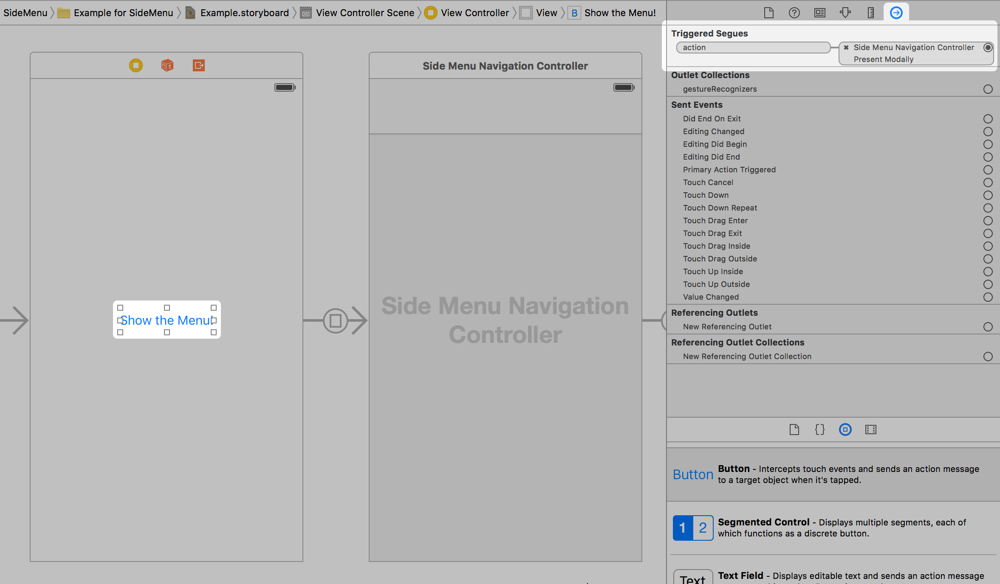

# SideMenu
[](http://cocoapods.org/pods/SideMenu)
[](http://cocoapods.org/pods/SideMenu)
[](http://cocoapods.org/pods/SideMenu)

## Shameless Requests First
**1. If you like SideMenu, give it a ★ at the top right of this page.**

**2. I need an invite to Dribbble to share SideMenu. Invite me: https://dribbble.com/jonkykong**

## Overview

SideMenu is a simple and versatile side menu control written in Swift.
- [x] **It can be implemented in storyboard without a single line of [code](#code-less-storyboard-implementation).**
- [x] Four standard animation styles to choose from (even parallax if you want to get weird).
- [x] Highly customizable without needing to write tons of custom code.
- [x] Supports continuous swiping between side menus on boths sides in a single gesture.
- [x] Global menu configuration. Set-up once and be done for all screens.
- [x] Menus can be presented and dismissed the same as any other View Controller since this control uses custom transitions.

Check out the example project or this [interactive demo](https://appetize.io/app/64a9v3e6b8c6f53zvn5pnny80m) to see it in action!






## Requirements
- [x] iOS 8 or higher

## Installation

### CocoaPods

[CocoaPods](http://cocoapods.org) is a dependency manager for Cocoa projects. You can install it with the following command:

```bash
$ gem install cocoapods
```

To integrate SideMenu into your Xcode project using CocoaPods, specify it in your `Podfile`:

```ruby
source 'https://github.com/CocoaPods/Specs.git'
platform :ios, '8.0'
use_frameworks!

pod 'SideMenu'
```

Then, run the following command:

```bash
$ pod install
```

## Usage
### Code-less Storyboard Implementation
1. Create a Navigation Controller for a side menu. Set the custom class of the Navigation Controller to be `UISideMenuNavigationController` in the **Identity Inspector**. Create a Root View Controller for the Navigation Controller (shown as a UITableViewController below). Set up any Triggered Segues you want in that View Controller.


2. Set the `Left Side` property of the `UISideMenuNavigationController` to On if you want it to appear from the left side of the screen, or Off/Default if you want it to appear from the right side.


3. Add a UIButton or UIBarButton to a View Controller that you want to display the menu from. Set that button's Triggered Segues action to modally present the Navigation Controller from step 1.


That's it. *Note: you can only enable gestures in code.*
### Code Implementation
First:
```swift
import SideMenu
```

In your View Controller's `viewDidLoad` event, do something like this:
``` swift
// Define the menus
let menuLeftNavigationController = UISideMenuNavigationController()
menuLeftNavigationController.leftSide = true
// UISideMenuNavigationController is a subclass of UINavigationController, so do any additional configuration of it here like setting its viewControllers.
SideMenuManager.menuLeftNavigationController = menuLeftNavigationController

let menuRightNavigationController = UISideMenuNavigationController()
// UISideMenuNavigationController is a subclass of UINavigationController, so do any additional configuration of it here like setting its viewControllers.
SideMenuManager.menuRightNavigationController = menuRightNavigationController

// Enable gestures. The left and/or right menus must be set up above for these to work.
// Note that these continue to work on the Navigation Controller independent of the View Controller it displays!
SideMenuManager.menuAddPanGestureToPresent(toView: self.navigationController!.navigationBar)
SideMenuManager.menuAddScreenEdgePanGesturesToPresent(toView: self.navigationController!.view)
```
Then from a button, do something like this:
``` swift
presentViewController(SideMenuManager.menuLeftNavigationController!, animated: true, completion: nil)
```
That's it.
### Customization
Just type `SideMenuManager.menu...` and code completion will show you everything you can customize (defaults are shown below for reference):
``` swift
menuPresentMode:MenuPresentMode = .ViewSlideOut
menuAllowPushOfSameClassTwice = true
menuAllowPopIfPossible = false
menuWidth: CGFloat = max(round(min(UIScreen.mainScreen().bounds.width, UIScreen.mainScreen().bounds.height) * 0.75), 240)
menuAnimationPresentDuration = 0.35
menuAnimationDismissDuration = 0.35
menuAnimationFadeStrength: CGFloat = 0
menuAnimationTransformScaleFactor: CGFloat = 1
menuAnimationBackgroundColor: UIColor? = nil
menuShadowOpacity: Float = 0.5
menuShadowColor = UIColor.blackColor()
menuShadowRadius: CGFloat = 5
menuLeftSwipeToDismissGesture: UIPanGestureRecognizer?
menuRightSwipeToDismissGesture: UIPanGestureRecognizer?
menuParallaxStrength: Int = 0
menuFadeStatusBar = true
menuBlurEffectStyle: UIBlurEffectStyle? = nil // Note: if you want cells in a UITableViewController menu to look good, make them a subclass of UITableViewVibrantCell!
menuLeftNavigationController: UILeftMenuNavigationController? = nil
menuRightNavigationController: UIRightMenuNavigationController? = nil
menuAddScreenEdgePanGesturesToPresent(toView toView: UIView, forMenu:UIRectEdge? = nil) -> [UIScreenEdgePanGestureRecognizer]
menuAddPanGestureToPresent(toView toView: UIView) -> UIPanGestureRecognizer
```

## Known Issues
Don't try to change the status bar appearance when presenting a menu. When used with quick gestures/animations, it causes the presentation animation to not complete properly and locks the UI. See [radar 21961293](http://www.openradar.me/21961293) for more information.

## About Me
My name is Jon Kent and I'm a freelance iOS designer, developer, and mobile strategist. I love coffee and play the drums. **Hire me!**

🌎 Web: [http://jonkent.me](http://jonkent.me)

✉️ Email: [contact@jonkent.me](mailto:contact@jonkent.me)

## License

SideMenu is available under the MIT license. See the LICENSE file for more info.
